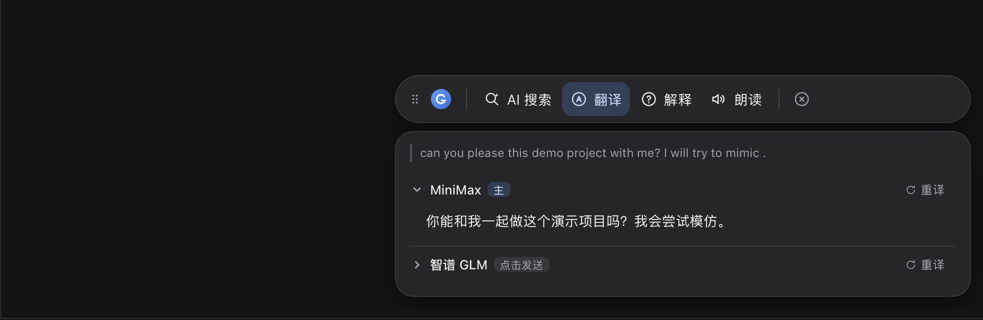
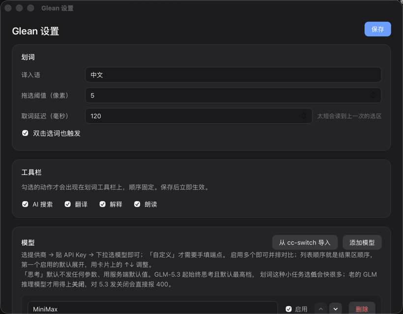

<div align="center">
  
  <h1>Glean</h1>
  <p><b>为外语学习者打造的划词翻译工具</b></p>
  <p>多模型同时翻译 · 并排对比 · 一键朗读 · 名词话术 AI 解释</p>
</div>

在任何应用里划选文字，光标旁即刻浮出工具栏：多个模型同时翻译、结果并排对比，
帮你交叉验证拿不准的句子；配上一键朗读，边看边听。遇到陌生的名词、术语或行话，
也可以就地切换到 AI 搜索与解释，把它当一部随身的百科词典。
全程不切窗口、不抢焦点、不丢选区。



## 功能

- 🖱️ **系统级划词** —— 浏览器、编辑器、PDF、聊天窗……拖选或双击选词都会触发，
  工具栏浮在光标旁、不抢底层窗口的焦点，选区不丢
- 🌐 **多模型对比** —— 同一段文本多路并排；列表顺序就是优先级，第一个启用的模型
  立即出结果、默认展开，其余展开才发请求
- 🔁 **重译** —— 哪列不满意就单独重掷一次（温度抬高，更容易给出不同译法）
- 🗣️ **朗读** —— 系统音色可选（中文建议选 zh_CN 音色）、语速滑杆可调、设置页可试听；
  再点一次即停，划新词自动停旧朗读
- 🧩 **配置零门槛** —— 选提供商 → 贴 API Key → 下拉选模型；用 [cc-switch](https://github.com/farion1231/cc-switch)
  的话一键导入已有配置
- 🍎 **macOS 原生体验** —— 菜单栏常驻、不占 Dock；不抢焦点的非激活面板；
  划词文本完全不出本机（如果你只用本地模型）

## 快速开始

### 安装

从 [Releases](../../releases) 下载最新的 `.dmg`，拖进「应用程序」即可。

### 首次运行

1. **授权**：首次划词会没有反应——到「系统设置 → 隐私与安全性 → 辅助功能」
   勾上 Glean，然后重启 Glean。没有这个权限，全局监听和取词都无法工作。
2. **配模型**：点菜单栏的 Glean 图标 → 设置（或在工具栏上点左边的徽标）：

   

   模型卡三步走：**选提供商 → 贴 API Key → 下拉选模型**。内置智谱 / DeepSeek /
   MiniMax / Kimi / 通义等预设，只有「自定义」才需要手填 URL；模型下拉的候选
   可以点「刷新」从服务实时拉取。设置完点右上角「保存」。

3. **开用**：在任意应用里划选文字。

### 日常使用

- 工具栏上的动作在设置里可以开关，只留你用的
- 点手柄可以把工具栏拖到顺手的位置；`Esc` 或点空白处收起
- 结果区的文字可以选中复制
- 应用没有 Dock 图标，退出/设置都在菜单栏托盘里

## 模型配置说明

- **兼容所有 OpenAI 协议的服务**：云端（智谱、DeepSeek、MiniMax、Kimi、通义…）
  或本地（Ollama、llama.cpp、vLLM）都行
- **顺序即优先级**：设置页用模型卡上的 ↑↓ 调整，第一个启用的模型立即请求并默认展开
- **思考档位**：GLM-5.3 起始终思考且默认最高档（慢），划词场景选「低」会快很多；
  「关闭」只对老的 GLM 推理模型有效
- **从 cc-switch 导入**：设置页一键读取 `~/.cc-switch` 里已配好的供应商
  （端点协议自动换算，模型名自动清理）
- 配置落在 `~/Library/Application Support/Glean/config.json`，可直接手改

## 常见问题

- **划词没反应** —— 九成是辅助功能权限没给或给了之后没重启 App
- **某些应用里取不到词** —— 自绘 UI（部分 Electron 应用、游戏）不暴露选区，
  工具会自动回落到模拟 `Cmd+C`；再取不到就静默放弃
- **译文慢半拍 / 读到上一次的内容** —— 设置里把「取词延迟」调大一点（默认 120ms）
- **翻译结果带思考过程** —— 已在流里过滤 `<think>` 段；若模型把思考放在正文且格式
  特殊导致漏网，提个 issue

## 开发

技术栈：**Tauri 2 + Rust + React/TypeScript**，主攻 macOS。

```
crates/core/          # 与 UI 无关的纯逻辑：配置模型、OpenAI 流式客户端、think 过滤
gui/src/              # 前端（悬浮工具栏 + 设置窗，hash 路由共用一份产物）
gui/src-tauri/src/
  selection.rs        # 触发层（自建 CGEventTap）+ 取词层（get-selected-text）
  panel.rs            # 悬浮窗：非激活 NSPanel、光标定位、边缘翻转
  actions.rs          # 动作层：多模型流式、朗读(say)、fetch_models
```

```bash
cd gui && pnpm install && pnpm tauri:dev   # 开发
cd gui && pnpm tauri:build                 # 出包
```

> 仓库根的 `rust-toolchain.toml` 把工具链钉在原生 `aarch64`。依赖链里的 bindgen
> 需要与 Xcode 同架构的 libclang，Rosetta 下的 x86_64 工具链会在
> `appkit-nsworkspace-bindings` 上直接编译失败。

**为什么触发层不用 `rdev`**：它把键盘事件也一并订阅，而其内部调用的
`TSMGetInputSourceProperty` 断言必须在主队列上跑——工具开着时敲一下键盘就会
SIGTRAP 崩溃；且 macOS 下它不转发拖拽坐标，拖选位移恒为 0、划词不会触发。
所以自己建了只订阅鼠标按下/松开的 ListenOnly tap（`selection.rs`），顺带处理了
系统停用 tap 后的自动重启。

### 发版

1. 三处版本号同步：`gui/package.json`、`gui/src-tauri/tauri.conf.json`、
   `gui/src-tauri/Cargo.toml`（改完 `cargo check` 让 `Cargo.lock` 跟上）
2. `git tag -a vX.Y.Z && git push origin vX.Y.Z` → Actions 出 macOS universal 包，
   挂 draft release，需手动 Publish（否则更新器拿不到 latest.json）
3. 首次发版前：`pnpm tauri signer generate` 生成更新签名密钥对，公钥填进
   `tauri.conf.json` 的 `plugins.updater.pubkey`（现为占位符），私钥进仓库 Secrets

## 已知限制

- 没有 Apple Developer ID 签名与公证：每次更新后需重新授予辅助功能权限
- Windows / Linux 的悬浮窗只是普通置顶窗，没有「不抢焦点」保证；Wayland 不支持
  全局输入监听
- 朗读念原文，念某个模型的译文还没做
