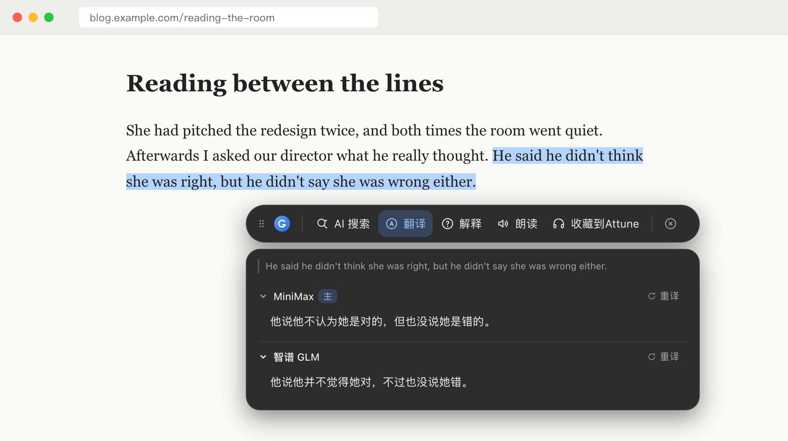
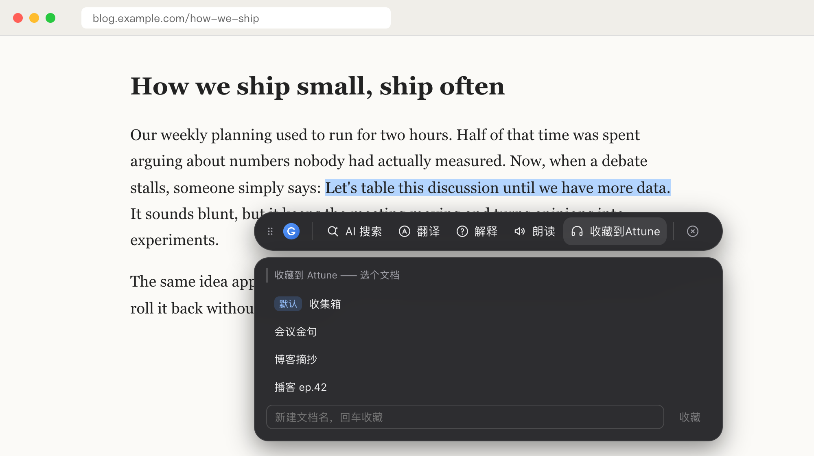
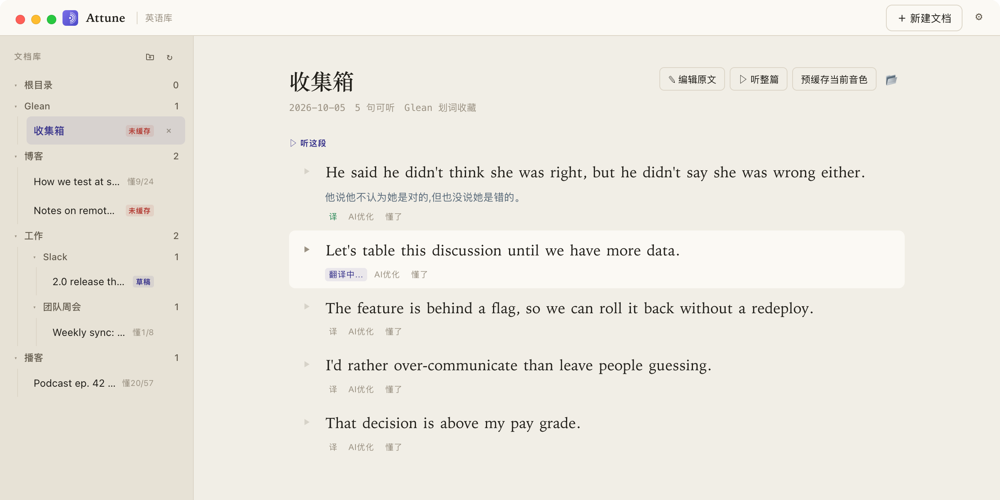
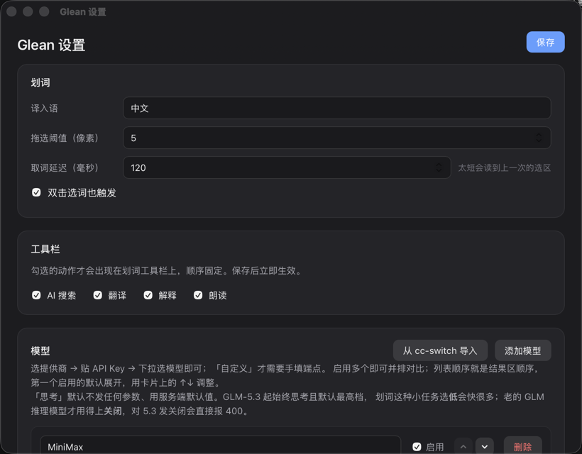

<div align="center">
  
  <h1>Glean</h1>
  <p><b>为外语学习者打造的划词翻译工具</b></p>
  <p>多模型同时翻译 · 并排对比 · 一键朗读 · 名词话术 AI 解释</p>
</div>

在任何应用里划选文字，光标旁即刻浮出工具栏：多个模型同时翻译、结果并排对比，
帮你交叉验证拿不准的句子；配上一键朗读，边看边听。遇到陌生的名词、术语或行话，
也可以就地切换到 AI 搜索与解释，把它当一部随身的百科词典。
全程不切窗口、不抢焦点、不丢选区。



## 功能

- 🖱️ **系统级划词** —— 浏览器、编辑器、PDF、聊天窗……拖选或双击选词都会触发，
  工具栏浮在光标旁、不抢底层窗口的焦点，选区不丢
- 🌐 **多模型对比** —— 多路结果并排；第一个启用的模型立即出结果，其余展开才发请求
- 🔁 **重译** —— 哪列不满意就单独重掷一次，更容易给出不同译法
- 🗣️ **朗读** —— 系统音色可选、语速滑杆可调、可试听；再点一次即停
- 🎧 **收藏到 Attune** —— 划到的好句子一键收进 [Attune](https://github.com/gebilaoman/Attune)，
  自动切句，在 Attune 里逐句精听、点词即查（已打通，见下文）
- 🧩 **配置零门槛** —— 选提供商 → 贴 API Key → 下拉选模型；cc-switch 用户一键导入

## 搭配 Attune：划到的句子，收进来逐句精听 ✅ 已打通

[**Attune**](https://github.com/gebilaoman/Attune) 是我们的英语听读工具：把英文切成一句一句，配上朗读和翻译，反复精听。
Glean 负责「在哪儿遇到都能收」，Attune 负责「收来之后听懂它」。

**第一步：在任意应用里划词，点「收藏到Attune」，选一个文档**（默认「收集箱」，也可以选已有文档或新建一个）：



**第二步：打开 Attune，句子已经在 `Glean/` 文件夹里**，切好句、能直接播放；
没有译文的句子，点「译」或播放时会自动补上翻译：



- **不用复制粘贴，也不用再跑 AI 转化**：收藏的内容直接存成 Attune 能播放的句子，同一句不会重复收藏。
- **零配置**：自动读取 Attune 的英语库位置；也可以在 Glean 设置 →「联动 Attune」里手动指定库目录、收藏文件夹和默认文档。
- 收藏后会自动打开 Attune；如果 Attune 已经开着，点侧栏的「↻ 刷新」就能看到新句子。

## 快速开始

从 [Releases](../../releases) 下载最新的 `.dmg`，拖进「应用程序」。

首次使用：

1. **授权**：首次启动会自动弹出系统的辅助功能授权请求，按提示允许即可。
   授权后 2 秒内自动生效，无需重启。升级后如再次提示，重新允许一次。
2. **配模型**：点菜单栏的 Glean 图标 → 设置：

   

   选提供商 → 贴 API Key → 下拉选模型（可点「刷新」实时拉取服务上的清单），
   点右上角「保存」。
3. **开用**：在任意应用里划选文字。`Esc` 或点空白处收起，点手柄可拖动位置。

## 常见问题

- **划词没反应** —— 辅助功能权限没给对；升级应用后需重新授权一次
- **某些应用里取不到词** —— 自绘 UI 不暴露选区，会自动回落到模拟 `Cmd+C`，
  再取不到就静默放弃
- **译文慢半拍 / 读到上一次的内容** —— 设置里把「取词延迟」调大一点（默认 120ms）
- **GLM 翻译很慢** —— 思考档位选「低」；GLM-5.3 起默认最高档
- **遇到问题想反馈** —— 设置页最底部「诊断日志」展开即可查看/复制运行日志

## 开发

Tauri 2 + Rust + React/TypeScript，目前仅支持 macOS。

```bash
cd gui && pnpm install && pnpm tauri:dev   # 开发
cd gui && pnpm tauri:build                 # 出包
```

## 已知限制

- 无 Apple Developer ID 签名：每次更新应用后需重新授予辅助功能权限
- Windows / Linux 尚未支持
- 朗读念原文，念译文还没做
